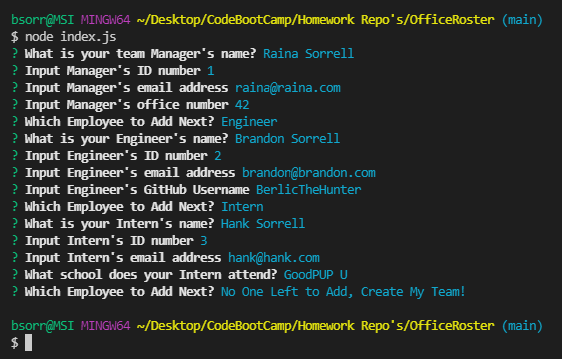

# OfficeRoster
console app to input information about employees and display in browser 

## Table of Contents
* [Description](#description)
* [Installation](#installation)
* [Usage](#usage)
  * [License](#license) 
* [Contributing](#contributing)
* [Tests](#tests)
* [Questions](#questions)

----

## Description
This project was assigned as part of the GTPE Coding Bootcamp to create an a console application using node.js and express to allow a user to input information about the manager, engineers,and interns on a team and display that information ina nicely formatted broswer page. This 

----

## Installation
This project requires the installation of node. copy the file "index.js" and all folders from this repo into the desired directory.

----

## Usage
To use this command line tool, 
* run "npm init" and answer the prompts 
* run "npm install inquirer" 
* run "npm install fs"  
* run "npm install jest"

This file project is dependent on node.js, inquirer.js, fs.js, jest.js and the provided files ( in the prearranged directories). 

After the required install, simpley run "node index.js" in the command line and answer the following prompts.

[Example Video](https://drive.google.com/file/d/1Y9g-sOVtKZiQ11I02Iy44UlKJdivdEDP/view)

[Go to the Repo](https://github.com/BerlicTheHunter/OfficeRoster)

[Go To Project Example](https://berlicthehunter.github.io/OfficeRoster/dist/index.html)

## License
This project is licensed under MIT License and can be found [here](./LICENSE)

----

## Contributing
This project is not accepting contributions at this time

----

## Tests
Tests for each employee class are included and can be run using
"npm test"

----

## Questions
For any other questions, please the the provided links below
* [Github](https://github.com/BerlicTheHunter)
* [Email](mailto:bsorrell3@gmail.com)
